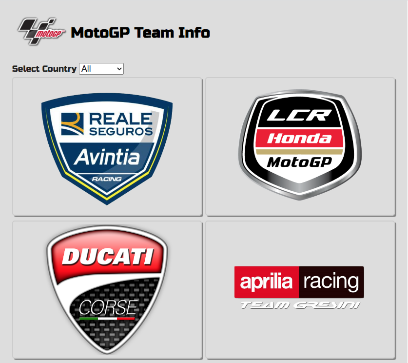
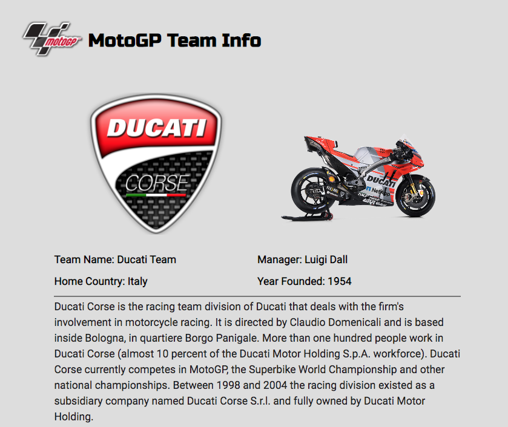
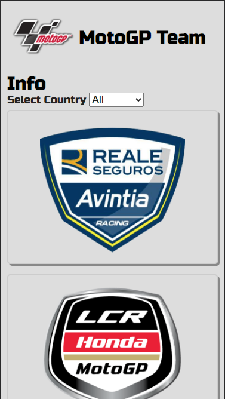

# MotoGP Database

2020 MotoGP championship team info. Catalogue of Statistics. Single Page App for MotoGP fans. Users can see all the teams or select teams by country. Fast, dynamic and responsive build with React & Redux. Data from the [thesportsdb API](https://www.thesportsdb.com/).

## Table of Contents

- [Technologies Used](#Technologies-Used)
- [Live Version](#Live-version)
- [Video](#Video)
- [Screenshots](#Screenshots)
- [Install and Run](#How-to-Install-and-Run-in-Your-Computer)
- [Acknowledgments](#Acknowledgments)
- [Author](#Author)
- [Contributing](#Contributing)
- [Show your support](#Show-your-support)

## Technologies Used

- Node.js
- React
- React-DOM
- React-Create-App
- React-Router-Dom
- Redux
- npm
- HTML/CSS
- ES6
- ESlint
- Netlify

[Up](#Table-of-Contents)

## Live version

A live version is hosted on Netlify.

- [**Motogp**](https://motogp-macnick.netlify.app/) @ Netlify

[Up](#Table-of-Contents)

## Video

Here is a video explanation of the project.

- [**Motogp**](https://www.loom.com/share/1d4c318ce48a43bcac3e2f1e5590911f) @ Loom

[Up](#Table-of-Contents)

## Screenshots

### Home, list of all teams

### Team Details

### Mobile

[Up](#Table-of-Contents)

## How to Install and Run in Your Computer

To run the scripts **npm** is required. To get npm you have to install [Node.js](https://nodejs.org). Follow the installation instructions for your system Mac, Linux or Windows.

Use your terminal and run the commands after each instruction.

| Command                                              | Description                                           |
| ---------------------------------------------------- | ----------------------------------------------------- |
| `git clone https://github.com/macnick/motogp-db.git` | Clone the repository to you computer                  |
| `cd rmotogp-db`                                      | Navigate to the newly created folder                  |
| `npm install`                                        | Install dependencies and launch browser with examples |
| `npm start`                                          | Makes the build and starts the development server     |
|                                                      | Press `Ctrl + c` to kill **http-server** process      |
| `http://localhost:3000`                              | Visit this link to use the motogp-db                  |

[Up](#Table-of-Contents)

## Acknowledgments

- [Microverse](https://www.microverse.org) software development school
- [Saheed Oladele](https://github.com/suretrust) code review
- [Louis Chia](https://github.com/shloch) code review
- [Sérgio Torres da Silveira Filho](https://github.com/Torres-ssf) code review

[Up](#Table-of-Contents)

## 👤 Author

## Nick Haralampopoulos

- Github: [@macnick](https://github.com/macnick)
- Twitter: [@mac_experts](https://twitter.com/mac_experts)
- Linkedin: [Nick Haralampopoulos](https://www.linkedin.com/in/nick-haralampopoulos/)
- AngelList: [Nick Haralampopoulos](https://angel.co/u/nick-haralampopoulos)

## 🤝 Contributing

Contributions, issues and feature requests are welcome!

Feel free to check the [issues page](https://github.com/macnick/motogp-db/issues).

1. Fork it (https://github.com/macnick/motogp-db/fork)
2. Create your feature branch (git checkout -b my-new-feature)
3. Commit your changes (git commit -am 'Add some feature')
4. Push to the branch (git push origin my-new-feature)
5. Create a new Pull Request

## Show your support

Spare a ⭐️ if you enjoyed this project!

## 📝 License

This project is [MIT](lic.url) licensed.
